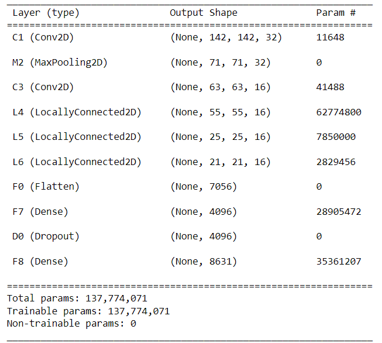
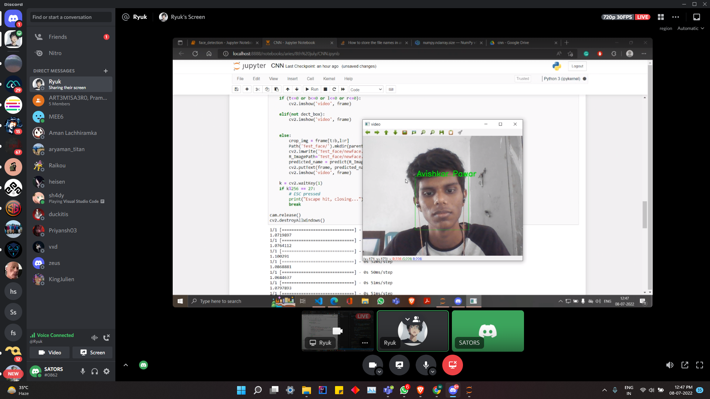
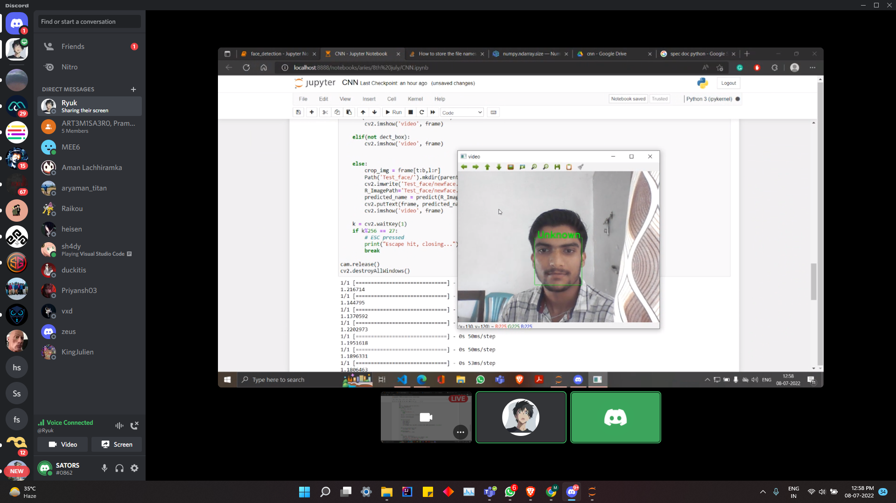

# Door Opening using Facial Recognition
- ## Create Dataset
- Using OpenCV for camera input and video output.
- Detect face using Dlib frontal face detector which impliments Histogram of Oriented Gradients (HOG) .
- Press "s" and enter your name to create folder for your name.
- Press "space" to save cropped images in folder.

- ## CNN

- Fine-tuning DeepFace CNN Model for our dataset.

- ## Face Embedding
-  Using Fine-tuned CNN model to create Embedding matrix for images in dataset.
-  Creating array of Embedding Matrices.

- ## Prediction
- Using OpenCV for input from camera feed in realtime.
- Making Embedding Matrix for cropped input image from live camera feed.
- Finding Euclidean distance by comparing Embedding Matrix of input image and saved Embedding Matrix.
- Using Euclidean distance to identify person.
### Person Identified

### Unknown Person

- ## Door Opening
- Press "space" to verify person.
