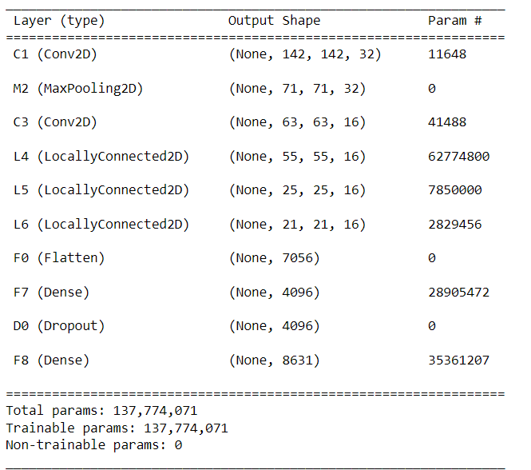

# Door opening using facial recognition
- ## Create dataset
- using open cv for camera input and video output.
- Detect face using dlib frontal face detector which impliments hog.
- Press "s" and enter your name to create folder for your name.
- Press "space" to save cropped images in folder.

- ## CNN

- Finetunning DeepFace CNN Model for our dataset.

- ## Face Embedding
-  using Finetunned cnn model to create Embedding matrix for images in dataset.
-  creating array of embedding matrices.

- ## Prediction
- using open cv for input from camera feed in realtime.
- making embedding matrix for cropped input image from live camera feed.
- finding euclidean distance by comparing embedding matrix of input image and saved embedding matrix.
- using euclidean distance to identify person.
### person identified

### unknown person

- ## Door opening
- Press "Space" to verify person.
